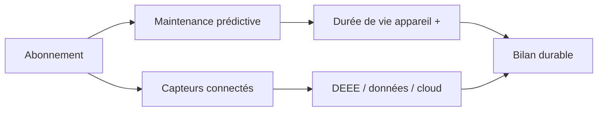

> ⬅ [[Q72_GeneveTour]] · [[00_Index_30_mises_en_situation|🗂 Index]] · [[Q74_CoopLog]] ➡

# Q73 — MedTechPlus : transformer un dispositif médical en abonnement connecté

## Situation

**MedTechPlus**, entreprise de **480 salariés**, vend des appareils médicaux robustes. Elle veut désormais vendre le matériel moins cher et facturer un abonnement cloud de suivi, avec renouvellement des capteurs tous les deux ans.

### Question

**Analysez si ce nouveau modèle crée réellement davantage de valeur durable que la vente classique.**

## 1. Découpage

Attention : **abonnement ≠ automatiquement économie de fonctionnalité durable**. Il faut voir si le service prolonge réellement l'actif ou crée de l'obsolescence supplémentaire.

## 2. Notions

- **RCOV/BMC :** changement de proposition de valeur et revenus.
- **BM durable :** impacts positifs + externalités.
- **3R :** réduire, réutiliser, recycler.
- **RNE :** cyber, données, environnement.
- **Privacy by design :** protection dès la conception.

## 3. Argumentation

### Gains

- Maintenance à distance.
- Revenus récurrents.
- Détection précoce des pannes.
- Potentiel d'allongement de la durée de vie du dispositif principal.

### Limites

- Capteurs remplacés tous les deux ans.
- DEEE.
- Verrouillage cloud.
- Données médicales sensibles.

### Méthode

Éco-concevoir les capteurs, organiser leur reprise, minimiser les données, conserver certaines fonctions essentielles hors cloud et mesurer la durée de vie réelle.

## 4. Exemple

Si le service cloud évite de remplacer une machine de dix ans mais crée cinq générations de capteurs jetables, il faut comparer les deux flux matériels avant de conclure.

## 5. Schéma

## 6. Risques & piège

Verrouillage, données de santé, panne cloud, DEEE, abonnement mal accepté.

**Piège :** « service = durable » sans analyser la matière et les incitations.

### Recommandation

Adopter le modèle seulement si les capteurs sont réparables/repris, le cloud prolonge effectivement la durée de vie et les données sont minimisées.

---

---

⬅ [[Q72_GeneveTour]] · [[00_Index_30_mises_en_situation|🗂 Index des 30 cas]] · [[Q74_CoopLog]] ➡
