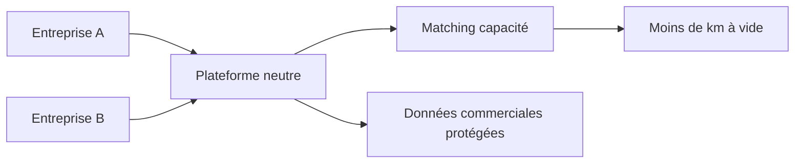

> ⬅ [[Q73_MedTechPlus]] · [[00_Index_30_mises_en_situation|🗂 Index]] · [[Q75_SolarHome]] ➡

# Q74 — CoopLog : partager ses données avec ses concurrents ?

## Situation

Cinq sociétés suisses de logistique envisagent **CoopLog**, plateforme commune pour mutualiser les trajets à vide. Elles restent concurrentes et craignent de révéler volumes, itinéraires, clients et capacités.

### Question

**La coopétition est-elle ici préférable à la concurrence traditionnelle ? Construisez le modèle de gouvernance stratégique.**

## 1. Découpage

La donnée est simultanément **ressource concurrentielle** et **ressource collective**. Le défi n'est donc pas seulement technique : c'est la gouvernance.

## 2. Notions

- **Coopétition :** coopérer sur certains sujets tout en restant concurrent.
- **Système de valeur :** performance créée entre plusieurs chaînes de valeur.
- **Porter :** la rivalité continue.
- **RNE/données :** minimisation, protection, responsabilités.

## 3. Argumentation

Un camion vide est une capacité inutilisée. Si le camion de A transporte la marchandise de B sans révéler les secrets commerciaux, tout le système peut gagner.

### Gouvernance

1. Objectif limité : réduire les kilomètres à vide.
2. Entité neutre.
3. Partage uniquement des données nécessaires au matching.
4. Interdiction d'utiliser les données pour démarcher les clients.
5. Audit et sanctions.
6. Règles de sortie du consortium.

## 4. Exemple

Le système peut annoncer « 10 palettes disponibles Genève-Lausanne à 14h » sans révéler le nom du client ni le prix du contrat.

## 5. Schéma

## 6. Risques & piège

Fuite de données, soupçon de collusion, bénéfices inégaux, biais de l'algorithme, effet rebond logistique.

**Piège :** définir la coopétition comme « devenir amis avec les concurrents ».

### Recommandation

Coopérer sur la **capacité logistique**, rester concurrents sur prix, clients et stratégie commerciale.

---

---

⬅ [[Q73_MedTechPlus]] · [[00_Index_30_mises_en_situation|🗂 Index des 30 cas]] · [[Q75_SolarHome]] ➡
