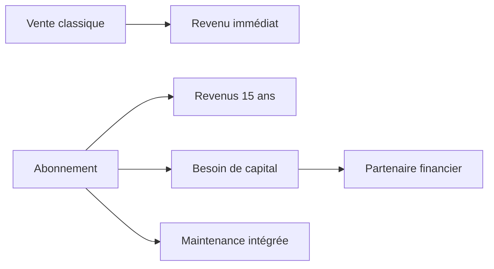

> ⬅ [[Q74_CoopLog]] · [[00_Index_30_mises_en_situation|🗂 Index]] · [[Q76_HotelLeman]] ➡

# Q75 — SolarHome : vendre des panneaux ou vendre de l'énergie comme service ?

## Situation

**SolarHome**, installateur solaire de **160 salariés**, vend actuellement des installations. Un concurrent lance une offre : aucun investissement initial, abonnement sur 15 ans incluant panneaux, batterie, maintenance et application intelligente.

### Question

**SolarHome doit-elle modifier son business model pour répondre à ce nouveau concurrent ?**

## 1. Découpage

Le concurrent ne change pas seulement le prix : il change **la proposition de valeur, les flux financiers et la propriété des actifs**.

## 2. Notions

- **Porter :** menace concurrentielle.
- **BMC :** nouveaux revenus, relations, ressources et coûts.
- **RCOV :** architecture de valeur.
- **Équation de profit :** revenus récurrents, mais besoin de capital.
- **RNE :** données énergétiques et cyber-risque.

## 3. Argumentation

L'abonnement réduit le frein du coût initial et fidélise. Mais SolarHome doit financer les actifs pendant quinze ans et supporter panne, maintenance et performance.

### Mise en œuvre

- Segmenter les clients.
- Construire un BMC spécifique.
- Modéliser les flux de trésorerie sur quinze ans.
- S'associer éventuellement à une banque.
- Lancer un pilote.
- Garder l'offre d'achat classique.

## 4. Exemple

Un propriétaire qui ne peut pas investir 30 000 CHF peut accepter une mensualité fixe si la production et la maintenance sont garanties.

## 5. Schéma

## 6. Risques & piège

Besoin de capital, défaut de paiement, performance technique, cybersécurité, contrat long, obsolescence.

**Piège :** copier le concurrent sans vérifier la **faisabilité financière**.

### Recommandation

Tester une offre **Energy-as-a-Service** sur certains segments, avec partenaire financier, tout en conservant la vente classique.

---

---

⬅ [[Q74_CoopLog]] · [[00_Index_30_mises_en_situation|🗂 Index des 30 cas]] · [[Q76_HotelLeman]] ➡
