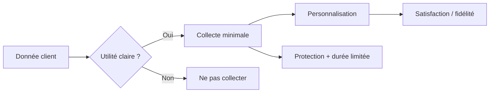

> ⬅ [[Q75_SolarHome]] · [[00_Index_30_mises_en_situation|🗂 Index]] · [[Q77_GreenHR]] ➡

# Q76 — HôtelLéman : jusqu'où personnaliser le client ?

## Situation / Énoncé

**HôtelLéman** est un groupe de **12 hôtels et 600 salariés**. Il veut utiliser l'IA pour centraliser historique de réservations, repas, horaires, température préférée en chambre et comportements numériques afin de personnaliser les séjours. La direction considère la donnée comme une ressource stratégique : plus elle connaîtrait le client, plus elle pourrait lui proposer une expérience sur mesure.

Le problème est que certaines informations sont très utiles, tandis que d'autres peuvent être intrusives, coûteuses à protéger ou simplement inutiles.

### Question d'examen

**Cette stratégie de personnalisation constitue-t-elle une source d'avantage concurrentiel ou un risque de RNE ?**

## 1. Découpage de la question & pose des bases

### Décorticage du sujet

La formulation « avantage concurrentiel **ou** risque de RNE » ne signifie pas forcément qu'il faut choisir un seul camp. Une excellente réponse dira : **la personnalisation peut créer de la valeur, mais uniquement si la collecte est proportionnée et gouvernée**.

L'enjeu principal est donc de distinguer :

- **donnée utile** : améliore une décision ou un service ;
- **donnée disponible** : existe techniquement mais n'est pas forcément nécessaire ;
- **donnée stratégique** : utile, fiable, difficile à reproduire et intégrée à une organisation capable de l'exploiter.

### Environnement & contexte

- Rivalité forte entre hôtels et plateformes de réservation.
- Clients sensibles à la qualité de l'expérience mais aussi à la confidentialité.
- Réglementation sur les données personnelles.
- Technologies IA de plus en plus accessibles : l'algorithme lui-même devient moins rare.
- Importance de la confiance dans une relation hôtelière.

### Diagnostic interne

- **Force :** historique de relation avec les clients réguliers.
- **Force :** possibilité de relier accueil, restauration et hébergement.
- **Faiblesse :** risque de données dispersées entre outils.
- **Ressource immatérielle :** confiance dans la marque.
- **Compétence à développer :** gouvernance, minimisation, consentement et design de services.

## 2. Développement des notions & définitions claires

- **Proposition de valeur :** ensemble des bénéfices promis au client : confort, simplicité, personnalisation, sécurité, plaisir, etc.
- **Ressource immatérielle :** actif non physique comme la réputation, la confiance ou les données structurées.
- **VRIO :** une ressource crée potentiellement un avantage durable si elle a de la valeur, est rare, difficile à imiter et bien exploitée par l'organisation.
- **RNE :** économique, technologique, environnementale et sociétale.
- **Privacy by design :** protection des données intégrée dès la conception.
- **Privacy by default :** réglages protecteurs appliqués par défaut.
- **Minimisation :** collecter seulement ce qui sert réellement l'objectif.
- **Sobriété numérique :** ici, elle peut aussi être comprise comme une sobriété de la donnée : moins de données, mieux choisies et mieux gouvernées.

## 3. Argumentation — Pourquoi et Comment

### Pourquoi personnaliser ?

1. Une expérience plus fluide peut améliorer la satisfaction et la fidélité.
2. Des préférences connues peuvent réduire les frictions lors des séjours répétés.
3. Certaines données peuvent aider à optimiser les ressources, par exemple la température de chambre ou les horaires de ménage.

### Pourquoi limiter ?

1. Chaque donnée supplémentaire augmente la surface de cyber-risque.
2. Le client peut percevoir une personnalisation trop précise comme de la surveillance.
3. La collecte et le stockage ont un coût économique et environnemental.
4. Une donnée inutilisée n'est pas un actif : elle devient plutôt une dette à protéger.

### Comment ?

Pour chaque donnée, HôtelLéman doit poser cinq questions :

1. **Quel besoin client sert-elle ?**
2. **Quelle décision améliore-t-elle ?**
3. **Le client comprend-il pourquoi elle est collectée ?**
4. **Combien de temps doit-elle être conservée ?**
5. **Peut-on créer la même valeur avec moins de données ?**

### Preuve & logique

**Préférence utile → service plus fluide → satisfaction → fidélité → valeur économique.**

Mais : **surcollecte → risque cyber + malaise → perte de confiance → dégradation de la ressource immatérielle**.

## 4. Exemples & mélange des concepts

- Mémoriser avec accord la préférence « chambre calme » peut créer une vraie valeur.
- Conserver pendant des années tous les clics de navigation sans usage clair crée peu de valeur et beaucoup de risque.
- Une allergie explicitement signalée peut être utile pour le restaurant ; il faut cependant définir qui y accède et combien de temps.

### Interconnexion

Le **BMC** montre que la personnalisation renforce potentiellement la proposition de valeur et la relation client. **VRIO** montre que l'algorithme est facilement imitable alors que la confiance, la qualité des données et les routines de service sont plus distinctives. La **RNE** impose de gérer les conséquences de cette collecte.

## 5. Graphique / schéma visuel

| SAF | Évaluation |
|---|---|
| **Souhaitabilité** | Élevée pour une personnalisation ciblée. |
| **Acceptabilité** | Élevée si transparente ; faible si invisible ou intrusive. |
| **Faisabilité** | Élevée techniquement, mais gouvernance à renforcer. |

## 6. Problèmes, risques & erreurs à éviter

- Fuite de données.
- Impression de surveillance.
- Biais dans la personnalisation.
- Coûts de stockage et de gouvernance.
- Dépendance à un fournisseur IA.
- Discrimination tarifaire ou traitement différencié mal perçu.

### Le piège classique

Dire **« la donnée est le nouvel or »** et conclure qu'il faut tout collecter. Une donnée ne vaut que si elle est utile, fiable, exploitable et gouvernée.

### Recommandation

Déployer une personnalisation **sélective, explicite et privacy-by-design**. Faire de la confiance et de la maîtrise des données un élément de la proposition de valeur.

---

---

⬅ [[Q75_SolarHome]] · [[00_Index_30_mises_en_situation|🗂 Index des 30 cas]] · [[Q77_GreenHR]] ➡
