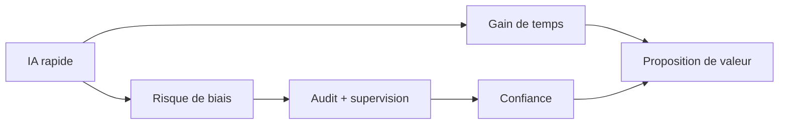

> ⬅ [[Q76_HotelLeman]] · [[00_Index_30_mises_en_situation|🗂 Index]] · [[Q78_ReUseIT]] ➡

# Q77 — GreenHR : l'IA de recrutement peut-elle devenir un avantage stratégique ?

## Situation / Énoncé

**GreenHR**, SaaS RH de **45 salariés**, commercialise un algorithme de présélection de candidatures. Il réduit de moitié le temps des recruteurs. Plusieurs clients craignent cependant des biais et demandent comment les recommandations sont produites.

La direction hésite entre communiquer uniquement sur la performance (« recrutez deux fois plus vite ») ou investir dans l'audit, la transparence, la documentation et la supervision humaine.

### Question

**Comment GreenHR doit-elle faire évoluer sa proposition de valeur pour transformer la responsabilité de l'IA en avantage concurrentiel ?**

## 1. Découpage & contexte

Le cas teste une idée importante : **une contrainte de responsabilité peut devenir une différenciation**. Si tous les concurrents promettent de gagner du temps, GreenHR peut créer davantage de valeur en réduisant aussi le **risque** que supporte le client.

### Environnement

- Marché SaaS très concurrentiel.
- Clients sous pression pour recruter plus vite.
- Crainte de discrimination et de biais.
- Évolution réglementaire autour de l'IA.
- Forte sensibilité réputationnelle des décisions d'emploi.

### Interne

- Produit techniquement performant.
- Processus de gouvernance à renforcer.
- Ressource immatérielle possible : réputation de fiabilité et de responsabilité.

## 2. Notions & définitions

- **RNE :** encadre impacts économiques, technologiques, sociaux et environnementaux de l'IA.
- **Biais algorithmique :** résultat systématiquement défavorable à certains groupes à cause des données, critères ou processus.
- **Supervision humaine :** l'humain conserve la capacité de comprendre, vérifier et contester la recommandation.
- **Proposition de valeur :** GreenHR ne vend pas seulement du temps gagné, mais aussi de la confiance et une réduction de risque.
- **VRIO :** l'algorithme est potentiellement copiable ; un système d'audit, une culture de gouvernance et une réputation peuvent être plus difficiles à reproduire.

## 3. Argumentation

### Pourquoi changer la proposition de valeur ?

Si GreenHR communique uniquement sur la vitesse, le produit entre dans une compétition de fonctionnalités. Un concurrent peut proposer une IA plus rapide ou moins chère.

En revanche, un recruteur professionnel se demande aussi :

- Puis-je expliquer la décision ?
- Puis-je corriger un rejet ?
- Comment vérifier un biais ?
- Qui est responsable ?

GreenHR peut donc vendre une **réduction du risque décisionnel**.

### Comment ?

1. Définir clairement le rôle du modèle : classement, recommandation ou décision ?
2. Auditer régulièrement les résultats.
3. Tester les biais.
4. Donner au recruteur la possibilité de contester/reprendre la main.
5. Documenter les critères et limites.
6. Former les clients à l'utilisation responsable.
7. Minimiser les données non pertinentes.

### Logique

**Vitesse seule → fonctionnalité copiable → avantage temporaire.**

**Vitesse + audit + contrôle humain + transparence → confiance → risque client réduit → différenciation plus défendable.**

## 4. Exemples & interconnexion

Un candidat rejeté automatiquement peut être réintroduit si le recruteur détecte que son parcours atypique n'a pas été correctement interprété.

Un tableau de bord peut suivre les taux de présélection et signaler des écarts importants nécessitant une analyse.

Le **BMC** transforme la responsabilité en proposition de valeur. La **RNE** fournit les exigences. **VRIO** montre que l'avantage repose sur l'organisation et la confiance davantage que sur le modèle brut.

## 5. Schéma

## 6. Risques & piège

- Faux sentiment d'objectivité.
- Biais historiques.
- Responsabilité floue.
- Coût d'audit.
- Surpromesse d'explicabilité.
- Mauvaise utilisation par les clients.

### Piège classique

Dire **« l'IA est objective car elle analyse des données »**. Les données et critères peuvent eux-mêmes être biaisés.

### Recommandation

Positionner GreenHR comme **« IA d'aide à la décision sous contrôle humain »** : vitesse, audit, transparence et capacité de contestation.

---

---

⬅ [[Q76_HotelLeman]] · [[00_Index_30_mises_en_situation|🗂 Index des 30 cas]] · [[Q78_ReUseIT]] ➡
