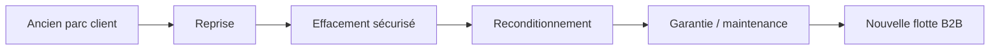

> ⬅ [[Q77_GreenHR]] · [[00_Index_30_mises_en_situation|🗂 Index]] · [[Q79_PrintAlps]] ➡

# Q78 — ReUseIT : comment battre les fabricants de PC neufs ?

## Situation

**ReUseIT**, PME de **90 salariés**, reconditionne des ordinateurs professionnels. Les grandes marques de PC neufs baissent leurs prix et communiquent désormais sur leurs propres programmes écologiques.

ReUseIT ne peut donc plus compter uniquement sur le message « le reconditionné est plus écologique ».

### Question

**Construisez une stratégie de différenciation durable pour ReUseIT en combinant Porter, ressources internes, 3R et business model.**

## 1. Découpage

L'objectif est de trouver une **différenciation non-prix** et difficile à imiter : sécurité, garantie, gestion de flotte, reprise et confiance.

### Contexte externe

- Rivalité croissante avec les constructeurs.
- Neuf moins cher.
- Demande d'achats IT responsables.
- Importance de la sécurité des données lors de la revente.

### Diagnostic interne

- Expertise de diagnostic et réparation.
- Possibilité d'effacement sécurisé.
- Réseau de collecte de machines.
- Données de taux de panne et de fiabilité.

## 2. Notions

- **Porter :** analyse de la rivalité et du pouvoir des grandes marques.
- **3R :** Réduire, Réutiliser, Recycler ; ReUseIT se situe surtout dans la réutilisation.
- **Coût du cycle de vie :** prix d'achat + utilisation + maintenance + fin de vie.
- **VRIO :** un processus certifié, une réputation B2B et un réseau de reprise peuvent devenir plus difficiles à imiter.
- **BMC :** passer d'une vente unitaire à une gestion de cycle de vie.

## 3. Argumentation

### Pourquoi ne pas se battre uniquement sur le prix ?

Les constructeurs disposent de volumes, de marketing et de chaînes d'approvisionnement puissantes. ReUseIT doit réduire le **risque perçu** du reconditionné.

### Comment ?

1. Standardiser le diagnostic.
2. Garantir les équipements.
3. Offrir effacement sécurisé des données.
4. Assurer maintenance et remplacement rapide.
5. Reprendre les machines en fin d'usage.
6. Vendre des contrats de flotte aux PME, écoles et administrations.

### Logique

**Garantie + certification → risque perçu ↓ → acceptation du reconditionné ↑.**

**Reprise → accès aux équipements → meilleure boucle circulaire.**

**Service de flotte → revenus récurrents → relation client renforcée.**

## 4. Exemple

Une école ne veut pas simplement « un PC moins cher ». Elle veut que 100 machines fonctionnent, soient sécurisées et rapidement remplaçables. ReUseIT peut vendre ce **niveau de service**.

## 5. Schéma

## 6. Risques & piège

- Approvisionnement irrégulier.
- Coût de garantie.
- Fuite de données.
- Écart de performance pour certains métiers.
- Concurrence des constructeurs.

### Piège classique

Penser que **« reconditionné » suffit à être différent**. Si tout le monde le propose, l'avantage disparaît.

### Recommandation

Devenir un **gestionnaire du cycle de vie IT B2B** : reprise, sécurité, reconditionnement, garantie, maintenance et reporting d'impact.

---

---

⬅ [[Q77_GreenHR]] · [[00_Index_30_mises_en_situation|🗂 Index des 30 cas]] · [[Q79_PrintAlps]] ➡
