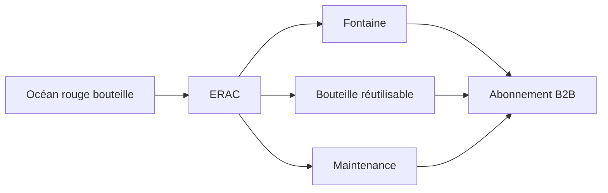

> ⬅ [[Q79_PrintAlps]] · [[00_Index_30_mises_en_situation|🗂 Index]] · [[Q81_Administration_cantonale]] ➡

# Q80 — AquaSwiss : sortir de l'océan rouge de l'eau en bouteille

## Situation

**AquaSwiss**, entreprise de **380 salariés**, vend de l'eau en bouteille. Le secteur est saturé : rivalité forte, produits proches, pression des distributeurs et substitut évident qu'est l'eau du robinet. AquaSwiss envisage des **fontaines connectées**, des bouteilles réutilisables et un abonnement B2B.

### Question

**Utilisez Porter, ERAC et le business model durable pour proposer une stratégie d'océan bleu.**

## 1. Découpage

Il faut partir du constat d'un **océan rouge** et montrer comment modifier les règles de valeur. Une « meilleure bouteille » n'est pas un océan bleu.

## 2. Notions

- **Porter :** secteur peu attractif si plusieurs forces sont fortes.
- **Océan bleu :** créer un espace de valeur moins directement disputé.
- **ERAC :** Exclure, Réduire, Augmenter, Créer.
- **BMC :** transformer revenus, canaux, activités et ressources.
- **BM durable :** réduire externalités du jetable et du transport.

## 3. Argumentation

### Diagnostic Porter simplifié

- Rivalité : forte.
- Pouvoir distributeurs : fort.
- Substituts : très forts.
- Nouveaux entrants : marque et distribution créent certaines barrières, mais marché mature.

### ERAC

| ERAC | AquaSwiss |
|---|---|
| **Exclure** | Une partie des bouteilles jetables dans le B2B. |
| **Réduire** | Transport d'eau, emballages, dépendance au rayon. |
| **Augmenter** | Qualité perçue, fiabilité, maintenance, service. |
| **Créer** | Fontaine + contenant durable + abonnement. |

### Nouveau business model

Le revenu passe partiellement de **« nombre de bouteilles vendues »** à **« service d'hydratation disponible »**.

## 4. Exemple

Une entreprise paie une mensualité comprenant installation, filtre, maintenance et contrôle qualité. Le fournisseur a intérêt à utiliser des équipements durables puisqu'il supporte lui-même le coût de remplacement.

## 5. Schéma

## 6. Risques & piège

Investissement matériel, maintenance, concurrence spécialisée, qualité sanitaire, greenwashing si le jetable reste dominant.

### Piège classique

Appeler « océan bleu » une innovation incrémentale. Il faut montrer une **modification simultanée de la valeur et des coûts** avec ERAC.

### Recommandation

Piloter une offre **Hydration-as-a-Service** auprès de bureaux/universités avant transformation à grande échelle.

---

---

⬅ [[Q79_PrintAlps]] · [[00_Index_30_mises_en_situation|🗂 Index des 30 cas]] · [[Q81_Administration_cantonale]] ➡
