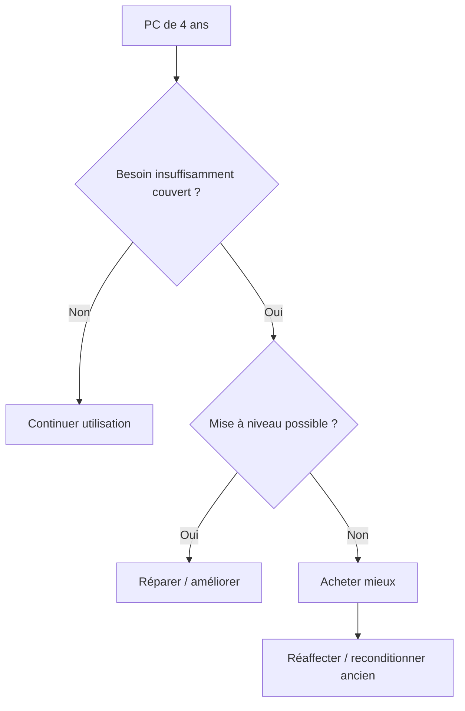

> ⬅ [[Q80_AquaSwiss]] · [[00_Index_30_mises_en_situation|🗂 Index]] · [[Q82_BioLab]] ➡

# Q81 — Administration cantonale : acheter 4 000 nouveaux laptops ?

## Situation

Une administration cantonale veut remplacer **4 000 ordinateurs de quatre ans** parce qu'un nouveau logiciel fonctionne mieux sur du matériel récent. Le service IT préfère renouveler tout le parc pour simplifier le support. Le service durabilité veut prolonger l'usage.

### Question

**En utilisant les achats IT responsables, le coût du cycle de vie et la RNE, construisez une politique de décision.**

## 1. Découpage

Le principe fondamental : **avant d'acheter mieux, demander s'il faut acheter**.

Le problème n'est donc pas « quel laptop acheter ? » mais **quels postes ont réellement besoin d'être remplacés ?**

## 2. Notions

- **3R :** Réduire → Réutiliser → Recycler.
- **ODD 12 :** consommation et production responsables.
- **Coût du cycle de vie :** achat + fonctionnement + maintenance + fin de vie.
- **Achats responsables :** acheter moins, acheter mieux, utiliser plus longtemps/mieux.
- **RNE :** environnement, sécurité, employabilité, usage responsable.

## 3. Argumentation

### Pourquoi éviter le remplacement uniforme ?

- Tous les utilisateurs n'ont pas les mêmes besoins.
- Quatre ans n'est pas une preuve d'obsolescence.
- Le renouvellement total simplifie le support mais externalise un coût matériel important.

### Politique recommandée

1. Segmenter les profils : bureautique, développement, graphisme, mobilité, accueil.
2. Mesurer les performances réelles.
3. Tester mises à niveau RAM/SSD/batterie.
4. Réaffecter les machines entre profils.
5. Acheter uniquement pour les besoins non satisfaits.
6. Dans l'appel d'offres : réparabilité, garantie, disponibilité pièces, consommation, reprise.
7. Effacer les données et reconditionner les machines sorties du parc.

## 4. Exemple

Un développeur peut nécessiter 32 Go de RAM, tandis qu'un poste d'accueil n'utilise que navigateur et bureautique. Leur imposer la même règle de remplacement est inefficace.

## 5. Schéma

## 6. Risques & piège

Parc hétérogène, sécurité, performances insuffisantes, coût de maintenance, effacement de données.

### Piège classique

Croire que **recycler** rend automatiquement le remplacement responsable. Le recyclage est le **dernier** des 3R.

### Recommandation

Adopter la règle **« remplacer sur besoin démontré, pas sur âge automatique »**.

---

---

⬅ [[Q80_AquaSwiss]] · [[00_Index_30_mises_en_situation|🗂 Index des 30 cas]] · [[Q82_BioLab]] ➡
