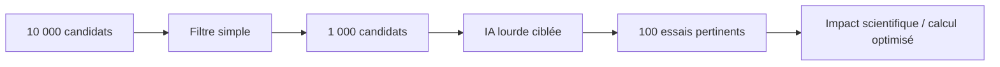

> ⬅ [[Q81_Administration_cantonale]] · [[00_Index_30_mises_en_situation|🗂 Index]] · [[Q83_CityRetail]] ➡

# Q82 — BioLab : peut-on être une start-up climat et utiliser énormément d'IA ?

## Situation

**BioLab**, start-up de **40 salariés**, développe des protéines alternatives grâce à des modèles d'IA très gourmands en calcul. Elle affirme que son produit réduira à terme certains impacts de l'élevage. Pourtant, ses dépenses cloud ont quadruplé en un an.

### Question

**Comment BioLab peut-elle arbitrer entre impact positif futur et externalités numériques présentes ?**

## 1. Découpage

Il faut éviter deux réponses simplistes :

- « l'IA consomme donc il faut arrêter » ;
- « le projet est écologique donc tous les calculs sont justifiés ».

La bonne réponse compare **scénarios, impacts présents, bénéfices futurs et incertitude**.

## 2. Notions

- **Externalité :** impact non entièrement reflété dans les coûts de l'entreprise.
- **BM durable :** mission + impacts positifs + externalités négatives.
- **Sobriété :** questionner le besoin avant d'augmenter la puissance.
- **Effet rebond :** calcul moins cher → plus d'expériences → consommation totale en hausse.
- **T-D-R :** matérialité de l'IA.

## 3. Argumentation

### Pourquoi l'IA peut être justifiée ?

Elle peut filtrer rapidement des milliers de candidats et éviter des essais physiques coûteux.

### Pourquoi elle doit être gouvernée ?

Si chaque baisse de prix du calcul pousse BioLab à tester dix fois plus de modèles, l'entreprise peut perdre toute discipline.

### Mise en œuvre

- Budget de calcul par phase.
- Modèles simples d'abord.
- Modèles lourds uniquement sur les candidats prometteurs.
- Critères d'arrêt.
- Mesure de l'information scientifique gagnée par unité de calcul.
- Publication séparée des impacts actuels et des bénéfices futurs estimés.

## 4. Exemple

Un modèle léger peut éliminer 90 % des pistes, puis un modèle complexe n'est exécuté que sur les 10 % restants. C'est une application concrète de la sobriété : **questionner et filtrer avant d'améliorer**.

## 5. Schéma

## 6. Risques & piège

Coûts cloud, dépendance, greenwashing, effet rebond, incertitude scientifique, empreinte matérielle.

### Piège classique

Présenter un bénéfice futur hypothétique comme s'il annulait automatiquement un impact présent mesuré.

### Recommandation

Créer une **gouvernance du calcul** avec budget, hiérarchisation des modèles et transparence sur les hypothèses.

---

---

⬅ [[Q81_Administration_cantonale]] · [[00_Index_30_mises_en_situation|🗂 Index des 30 cas]] · [[Q83_CityRetail]] ➡
