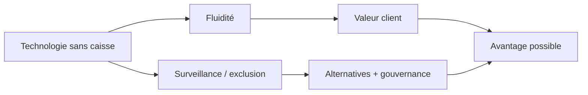

> ⬅ [[Q82_BioLab]] · [[00_Index_30_mises_en_situation|🗂 Index]] · [[Q84_ArtisanConnect]] ➡

# Q83 — CityRetail : magasins sans caisse et société sans cash

## Situation

**CityRetail**, distributeur de **100 magasins et 3 500 salariés**, veut généraliser des magasins sans caisse : application obligatoire, caméras, reconnaissance des produits et paiement automatique. Les coûts opérationnels pourraient baisser de **12 %**.

### Question

**Cette stratégie peut-elle constituer un avantage concurrentiel durable ? Analysez chaîne de valeur, RNE, accessibilité et parties prenantes.**

## 1. Découpage

Une réduction de coût est intéressante, mais pas nécessairement **durable** au sens concurrentiel. Si tous les concurrents peuvent acheter le même système, l'avantage technologique sera temporaire.

## 2. Notions

- **Chaîne de valeur :** marketing/vente et opérations en magasin.
- **Ressources/VRIO :** technologie achetable vs compétence organisationnelle.
- **RNE :** données, emploi, cyber, inclusion.
- **Accessibilité :** service utilisable sans imposer une barrière disproportionnée.
- **Parties prenantes :** clients, salariés, autorités, fournisseurs technologiques.

## 3. Argumentation

### Gains

- Moins de file.
- Réduction de certains coûts.
- Données de stock potentiellement plus précises.

### Risques

- Smartphone obligatoire.
- Paiement numérique obligatoire.
- Caméras et sentiment de surveillance.
- Suppression de postes.
- Dépendance à un prestataire de vision.

### Comment transformer l'innovation en avantage ?

CityRetail doit viser **« fluidité inclusive »** et non « suppression maximale des caisses ».

- Sans-caisse comme option.
- Borne/caisse assistée disponible.
- Assistance humaine.
- Minimisation des données vidéo.
- Formation et redéploiement du personnel.

## 4. Exemple

Un client pressé peut entrer avec son application. Une personne sans smartphone doit néanmoins pouvoir acheter sans humiliation ni parcours extrêmement complexe.

## 5. Schéma

## 6. Risques & piège

Erreurs de reconnaissance, cyberattaque, exclusion, résistance des salariés, dépendance fournisseur.

### Piège classique

**« -12 % de coûts = avantage concurrentiel durable. »** Un concurrent peut copier la technologie.

### Recommandation

Déployer comme **option multicanale**, avec alternatives simples et une gouvernance stricte des données.

---

---

⬅ [[Q82_BioLab]] · [[00_Index_30_mises_en_situation|🗂 Index des 30 cas]] · [[Q84_ArtisanConnect]] ➡
