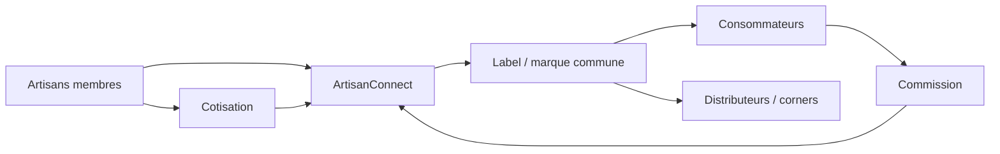

> ⬅ [[Q83_CityRetail]] · [[00_Index_30_mises_en_situation|🗂 Index]] · [[Q85_AlpFood]] ➡

# Q84 — ArtisanConnect : créer un « Oncle Hansi » numérique suisse ?

## Situation

**ArtisanConnect** regroupe **60 petites entreprises artisanales romandes**. L'association veut créer une marque commune garantissant fabrication régionale, une boutique en ligne et des corners chez certains distributeurs. Les membres verseraient une **cotisation fixe** et une **commission sur les ventes**.

Le modèle rappelle le cas du **Marché de l'Oncle Hansi**, où un label régional commun sert plusieurs producteurs et clientèles.

### Question

**Construisez le business model d'ArtisanConnect et expliquez dans quelles conditions la marque collective peut devenir un avantage concurrentiel durable.**

## 1. Découpage

Il faut distinguer plusieurs acteurs :

- les **artisans membres**, qui paient pour accéder au label et aux services ;
- les **consommateurs**, qui cherchent confiance, qualité et origine ;
- les **distributeurs**, qui cherchent un assortiment régional identifiable.

La plateforme web n'est pas le cœur de l'avantage : elle est un canal. Le cœur est la **confiance associée au label**.

## 2. Notions

- **BMC :** segments, proposition de valeur, canaux, relations, revenus, ressources, activités, partenaires, coûts.
- **RCOV :** comment ressources et organisation produisent la valeur.
- **Équation de profit :** cotisations + commissions − coûts de contrôle, marketing, plateforme et animation.
- **Ressource immatérielle :** marque et réputation.
- **VRIO :** un réseau crédible et une réputation construite sont plus difficiles à imiter qu'un site e-commerce.
- **Système de valeur :** artisans, association et distributeurs coopèrent.

## 3. Argumentation

### Proposition de valeur

**Pour l'artisan :** visibilité, distribution, mutualisation du marketing, label crédible.

**Pour le consommateur :** sélection, origine, confiance, découverte régionale.

**Pour le distributeur :** offre régionale lisible et cohérente.

### Architecture de valeur

- L'artisan garde sa production.
- ArtisanConnect contrôle la marque et les critères.
- Les distributeurs portent une partie de l'accès au marché.
- La plateforme centralise la découverte et éventuellement la vente.

### Équation de profit

**Revenus :** cotisations fixes + commissions + éventuellement services.

**Coûts :** contrôle du label, marketing, plateforme, animation réseau, corners.

### Condition d'avantage durable

Le label doit rester **crédible**. Un membre de mauvaise qualité peut détériorer la ressource commune.

## 4. Exemple & lien Oncle Hansi

Comme dans le cas Oncle Hansi, les entreprises membres peuvent être à la fois **clientes du groupement et partenaires de la proposition de valeur**. Elles financent une partie du système en cotisation/redevance et bénéficient de la marque commune.

## 5. Schéma

### Mini-BMC

| Bloc | ArtisanConnect |
|---|---|
| Segments | Artisans, consommateurs, distributeurs |
| Proposition de valeur | Origine crédible, sélection, visibilité |
| Canaux | E-commerce, corners, artisans |
| Revenus | Cotisations, commissions |
| Ressource clé | Label / réputation / réseau |
| Activité clé | Contrôle, animation, communication |
| Partenaires | Artisans, distributeurs |
| Coûts | Contrôle, plateforme, marketing |

## 6. Risques & piège

Qualité hétérogène, commission trop forte, « local washing », conflit avec marques individuelles, contrôle coûteux.

### Piège classique

Croire que le **site web** est la ressource stratégique. La ressource centrale est **la confiance dans le label et le réseau**.

### Recommandation

Construire ArtisanConnect comme **label gouverné avant d'être marketplace** : critères stricts, contrôle, gouvernance équitable, puis canaux numériques et corners.

---

---

⬅ [[Q83_CityRetail]] · [[00_Index_30_mises_en_situation|🗂 Index des 30 cas]] · [[Q85_AlpFood]] ➡
