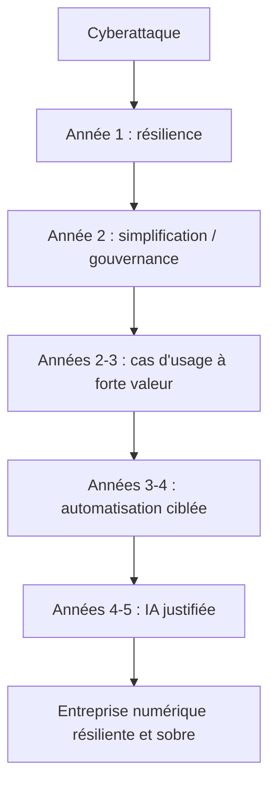

> ⬅ [[Q84_ArtisanConnect]] · [[00_Index_30_mises_en_situation|🗂 Index]] · [[99_Synthese_finale]] ➡

# Q85 — AlpFood : reconstruire après une cyberattaque sans recommencer « comme avant »

## Situation / Énoncé

**AlpFood SA**, entreprise agroalimentaire de **520 salariés**, vient de subir une cyberattaque majeure : commandes bloquées pendant cinq jours, données clients compromises et production fortement ralentie. Avant l'incident, la stratégie numérique était dispersée entre plusieurs fournisseurs, les responsabilités étaient floues et la continuité d'activité insuffisamment testée.

Le conseil d'administration veut investir **8 millions CHF** dans une transformation complète : cloud, IA, cybersécurité, automatisation et nouveaux outils collaboratifs.

### Question d'examen

**Vous êtes membre du comité de direction. Construisez la stratégie numérique à cinq ans d'AlpFood en reliant diagnostic, ressources, RNE, chaîne de valeur, compétences humaines et durabilité.**

## 1. Découpage de la question & pose des bases

### Décorticage du sujet

C'est le cas le plus transversal. L'examinateur veut voir si tu sais **prioriser**. La mauvaise réponse est une liste de technologies : « il faut du cloud, de l'IA, de la blockchain et de la cybersécurité ».

La bonne réponse commence ainsi :

> **Quel problème doit être résolu en premier pour que l'entreprise puisse continuer à créer de la valeur ?**

Réponse : **résilience, continuité et gouvernance**.

### Diagnostic externe

- Cybermenaces croissantes.
- Distributeurs exigeant continuité et traçabilité.
- Dépendance aux grands fournisseurs technologiques.
- Pression sur coûts, énergie et gaspillage.
- Évolution rapide de l'IA et de l'automatisation.

### Diagnostic interne

**Forces :** expertise agroalimentaire, usine, marque, relations distributeurs.

**Faiblesses :** architecture fragmentée, gouvernance floue, continuité insuffisante, dépendances mal cartographiées.

**Ressources critiques :** données de production, recettes/processus, relations clients, savoir-faire des opérateurs.

**Compétences à construire :** architecture, cybersécurité, données, gestion fournisseurs, conduite du changement.

## 2. Développement des notions & définitions claires

- **SWOT :** synthèse forces/faiblesses/opportunités/menaces.
- **Chaîne de valeur :** permet de savoir quels processus numériques sont critiques pour production, logistique, vente et service.
- **RCOV :** rappelle qu'un outil ne crée de valeur que s'il est intégré aux ressources, compétences et organisation.
- **RNE technologique :** cybersécurité, données, continuité.
- **RNE sociétale :** formation et employabilité.
- **RNE environnementale :** matériels, cloud, stockage, énergie.
- **Sobriété :** questionner avant de déployer.
- **Effet rebond :** plus de données et d'automatisation peuvent augmenter l'usage global.
- **VRIO :** acheter un cloud n'est pas rare ; une organisation résiliente combinant métier, données et sécurité peut devenir difficile à copier.
- **SAF :** outil de priorisation des options.

## 3. Argumentation — Pourquoi et Comment

### Pourquoi la sécurité vient avant l'IA

Une IA sophistiquée ne crée aucune valeur si l'entreprise ne peut plus prendre de commandes ou produire pendant cinq jours. La première capacité stratégique à restaurer est donc la **continuité de l'activité**.

### Feuille de route proposée

#### Année 1 — Sécuriser et comprendre

- Inventaire des actifs et systèmes.
- Cartographie des données.
- Cartographie des fournisseurs et dépendances.
- Sauvegardes isolées et tests de restauration.
- Segmentation des réseaux.
- Gestion stricte des droits d'accès.
- Plan de continuité et scénarios de crise.
- Formation de toutes les équipes.

#### Année 2 — Simplifier et gouverner

- Réduire les doublons d'outils.
- Définir propriétaires de données.
- Créer standards d'architecture.
- Renégocier les contrats fournisseurs.
- Prévoir réversibilité et portabilité.

#### Années 2 à 3 — Numériser les points de forte valeur

- Traçabilité des lots.
- Maintenance des machines.
- Prévision de la demande.
- Optimisation des stocks.
- Planification logistique.

Chaque projet doit avoir un **KPI métier**, pas seulement un KPI technique.

#### Années 3 à 4 — Automatiser sélectivement

Automatiser les tâches répétitives ou génératrices d'erreurs, mais conserver la supervision et transformer les compétences.

#### Années 4 à 5 — IA seulement là où le besoin est démontré

L'IA ne doit pas être une obligation symbolique. Elle doit répondre à un cas d'usage mesurable mieux qu'une solution plus simple.

### Chaînes de causalité

**Architecture fragmentée → vulnérabilité + complexité → simplification + gouvernance → résilience.**

**Traçabilité → localisation rapide des lots → moins de destruction → gain économique + environnemental.**

**Maintenance prédictive → panne évitée → disponibilité usine + durée de vie machines.**

**IA partout → plus de calcul et de dépendance → sobriété → sélectionner les cas réellement utiles.**

## 4. Exemples & mélange des concepts

- Un système de sauvegarde testé crée probablement plus de valeur immédiate qu'un nouveau chatbot.
- Une maintenance prédictive ne peut fonctionner correctement que si les données de machine sont fiables.
- Les opérateurs doivent participer au choix des automatisations, car ils connaissent les exceptions réelles du processus.
- Un KPI cyber peut être le **temps de reprise après incident**.
- Un KPI durable peut être le **volume absolu de pertes alimentaires évitées**.

### Interconnexion

Le **SWOT** révèle les faiblesses. Le **PESTEL/Porter** montre les menaces et dépendances. La **chaîne de valeur** priorise les processus. **RCOV** montre qu'il faut compétences et organisation. La **RNE** encadre sécurité, personnes et environnement. La **sobriété** empêche la fuite en avant technologique. **SAF** séquence les investissements.

## 5. Graphique / schéma visuel

### Matrice de priorité

| Projet | Valeur métier | Urgence | Risque | Priorité |
|---|---:|---:|---:|---:|
| Sauvegardes / continuité | Très élevée | Très élevée | Réduit fortement | **1** |
| Gouvernance des données | Très élevée | Élevée | Réduit | **2** |
| Traçabilité critique | Élevée | Élevée | Modéré | **3** |
| Maintenance prédictive | Élevée | Moyenne | Modéré | **4** |
| Chatbot IA générique | Faible/moyenne | Faible | Ajoute dépendance | **Plus tard** |

### SAF global

| Critère | Évaluation |
|---|---|
| **Souhaitabilité** | Très élevée : l'incident prouve la nécessité de transformation. |
| **Acceptabilité** | Élevée si les équipes sont impliquées et si les priorités sont claires. |
| **Faisabilité** | Moyenne : 8 MCHF obligent à prioriser, pas à tout faire. |

## 6. Problèmes, risques & erreurs à éviter

- Reproduire l'ancienne architecture avec des technologies plus neuves.
- Multiplier les outils sans compétences internes.
- Dépendre d'un fournisseur unique.
- Fatigue du changement.
- Effet rebond de stockage et de calcul.
- Faux sentiment de sécurité après achat d'un nouvel outil.
- Dispersion du budget sur trop de projets.

### Le piège classique

Répondre par un **catalogue technologique**. Une stratégie numérique n'est pas une liste d'achats.

### Recommandation finale

Adopter la séquence : **résilience d'abord → gouvernance → optimisation des processus → automatisation → IA en dernier**. Construire en parallèle les compétences humaines et des KPI économiques, sociaux et environnementaux.

---

---

⬅ [[Q84_ArtisanConnect]] · [[00_Index_30_mises_en_situation|🗂 Index des 30 cas]] · [[99_Synthese_finale]] ➡
